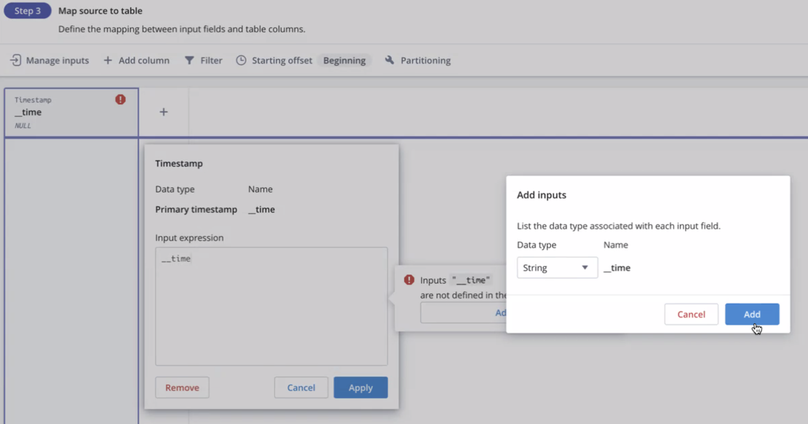

## Ahead of the workshop

#### Setup Your Imply Polaris account
Polaris is a SaaS solution powered by Apache Druid and Imply Pivot. Apache Druid for real-time data ingestion and analytics. Pivot for a rich data visualization and interactive analytics and dashboarding. During the workshop you will ingest real-time clickstream data and create a dashboard to visualize it.

* Create an Polaris account at https://imply.io/ click on `Start Free Trial` button.
* Then follow the instructions you'll get by email to logon to your Polaris environment.
* When prompted select `us-east-1` for the region.

#### Setup Your Decodable Account
Decodable is a stream transformation engine that is powered by Debezium and Flink to deliver end to end stream processing using SQL. We will use it during the workshop to ingest real-time data, enhance it and transform it in preparation for doing real-time analytics with Apache Druid.
You will need to have a decodable account to consume from the streaming data we will provide.
* Create an account at https://decodable.co using the "Start Free" button and take note of your `account name`.
* When prompted select `us-east-1` for the region.
* Download the [Decodable CLI](https://docs.decodable.co/docs/command-line-interface)
* Open a terminal window which we will be using throughout the workshop.
* Setup the Account in the Command Line:
```
decodable config setup <account name>
```


## On the Day of the Workshop
* Open a terminal window.
* Login to the Account using command:
```
decodable login
```
This will open a browser and ask you to login to your decodable account.

* Leave this terminal open for use during the workshop.

# Create Source Connections
### Connections
Connections can be created through the web portal but inputing fields by hand will take too long so you can use the CLI commands provided to do this.
Let's start with the userinfo pipeline which we will use to enhance the clickstream data for analytics.

### Building the Real-Time Pipeline on Decodable
Overall we will be ingesting two sources of data. One provides the latest user profile data whenever the user changes info about their profile. The second is their click activity on a retail website that sells novelty products.

Apache Druid works best when the data is pre-joined, so we will use Decodable to join the two data sets and do some light data transformation.
Clicks are separate events that are logically related to each other in a user session. The clickstream data itself may not be enough to determine which set of clicks correspond to a session, so we will use the time gap between clicks as an indicator of new session and generate a session_id so we can group clicks into sessions that we can then analyze.

#### The userinfo Pipeline

##### Create "userinfo" Source Connection
```
decodable connection create \
--name userinfo \
--type source \
--connector kafka \
--prop bootstrap.servers="kafka://pkc-4nym6.us-east-1.aws.confluent.cloud:9092" \
--prop sasl.username="SXI62EFFW45JR5TM" \
--prop sasl.password="owfxek2GmpO0Q980+m4DWjqIzrcTWifdMLpMiksQoha08irc1w1joR6RKohKo0xK" \
--prop topic=workshop_userinfo \
--prop format=json --prop sasl.mechanism="PLAIN" --prop security.protocol=SASL_SSL \
--field "__time"=string \
--field-computed info_change_timestamp="TO_TIMESTAMP(""__time"",'yyyy-MM-dd''T''HH:mm:ss.SSS')" \
--field user_id="int NOT NULL" \
--field first_name=string \
--field last_name=string \
--field dob=string \
--field address_lat=double \
--field address_long=double \
--field marital_status=string \
--field income=int \
--field signup_ts=string
```
Then from the decodable portal, select the connection you just created 'userinfo' and click on "Start".


##### User Info Change Stream
The `userinfo_source` stream is automatically generated when you create the connection. Since the command does not specify a primary key it is created as an append stream. We'll need to feed it into a Change stream in order to use it to enhance the clickstream data with a temporal join to the userinfo such that we get the user's profile data as of the time of each event.

First, you'll need to create a change stream for the userinfo. Start by defining the change stream from the CLI as :
```
decodable stream create \
--name userinfo_change  \
--description "holds the changes to the user profile" \
--field "__time"="timestamp(3)" \
--field user_id="int NOT NULL" \
--field first_name=string \
--field last_name=string \
--field dob=string \
--field address_lat=double \
--field address_long=double \
--field marital_status=string \
--field income=int \
--field signup_ts=string \
--partition-key user_id \
--primary-key user_id
```

From the Decodable portal, create a new pipeline with `userinfo_source` as its input stream the SQL is a simple projection of the source stream:
```
insert into userinfo_change
select info_change_timestamp as __time, user_id, first_name, last_name, dob, address_lat, address_long, marital_status, income,  signup_ts
from userinfo_source
```
Since the `userinfo_change` stream was created with the a primary key, this pipeline will apply temporal upserts which can then be used to provide joins user rows as of the time of the clickstream events.  
- Save it and name it `consume_userinfo_changes` and give it a good description:


- You can preview the `consume_userinfo_changes` pipeline, select "Earliest" from the dropdown menu before running the preview so that it reads data already on the stream:


- Start the pipeline to start feeding `userinfo_changes` Change Stream. Also here, select "Earliest" in the Advanced Start Options to process data that is already on the stream:


#### The Clickstream pipeline
##### Create "clickstream" Source Connection
In this case you will create the connection but wait before starting it because you need to make some adjustments to the stream before starting the flow of data. We'll need to partition it on user_id and add a couple of calculated fields prior to using them such that the join to the userinfo can be created.

- Create but don't start the connection:

```
decodable connection create \
--name clickstream \
--type source \
--connector kafka \
--prop bootstrap.servers="kafka://pkc-4nym6.us-east-1.aws.confluent.cloud:9092" \
--prop sasl.username="SXI62EFFW45JR5TM" \
--prop sasl.password="owfxek2GmpO0Q980+m4DWjqIzrcTWifdMLpMiksQoha08irc1w1joR6RKohKo0xK" \
--prop topic=workshop_clickstream \
--prop format=json --prop sasl.mechanism="PLAIN" --prop security.protocol=SASL_SSL \
--field "__time"=string \
--field user_id=int \
--field event_type=string \
--field client_ip=string \
--field client_device=string \
--field client_lang=string \
--field client_country=string \
--field referrer=string \
--field keyword=string \
--field product=string
```

This will create the stream `clickstream_source`, find it in the Streams tab and edit it:
- Select `user_id` and set it as the partitioning key


- Click on the `+Add Field` button at the bottom to add computed field for `proc_time` and `click_timestamp`:
 - for `proc_time`, use expression `PROCTIME()`
 - for `click_timestamp`, use expression `TO_TIMESTAMP(__time,'yyyy-MM-dd''T''HH:mm:ss.SSS')`

- Click Save at the top
- Start the `clickstream` Connection from the Connections tab


#### Clickstream enhancement and transformation
In order to make the process scalable and make sure that join rows are distributed the same, we used a partitioning key of `user_id` on both the userinfo_change stream and the clickstream_source streams, here's how to do a temporal join between them:

* Create a pipeline that uses `clickstream_source` and `userinfo_source` as its inputs using the following SQL:
```
insert into clickstream_enhanced
select
    clickstream_source.click_timestamp as __time,
    clickstream_source.user_id,
    clickstream_source.event_type,
    clickstream_source.client_ip,
    clickstream_source.client_device,
    clickstream_source.client_lang,
    clickstream_source.client_country,
    clickstream_source.referrer,
    clickstream_source.keyword,
    clickstream_source.product,
    timestampdiff( YEAR, to_timestamp(userinfo_change.dob, 'yyyy-MM-dd''T''HH:mm:ss.SSS'), current_date) as user_age,
    userinfo_change.address_lat,
    userinfo_change.address_long,
    userinfo_change.marital_status,
    userinfo_change.income,
    TO_TIMESTAMP(userinfo_change.signup_ts, 'yyyy-MM-dd''T''HH:mm:ss.SSS') as signup_ts
from clickstream_source  
   join userinfo_change FOR SYSTEM_TIME AS OF clickstream_source.proc_time
       ON clickstream_source.user_id=userinfo_change.user_id
```
Notice that we use a temporal join between `clickstream_source` and `userinfo_change` with the clause `FOR SYSTEM_TIME AS OF clickstream_source.proc_time`.
* Click `Next` to create the target stream and save the pipeline, name it `clickstream_add_userinfo`, but don't start it yet.
* In the target stream `clickstream_enhanced` you'll need to mark the `__time` column as a watermark so that it can be used to order events using window functions.
* Also add `user_id` as the partition key to keep data aligned by user_id as it flows through parallel processing units of the pipeline.

* Click Save
* Start the new pipeline and then navigate back to the clickstream_enhanced stream to preview results.

#### Clickstream Sessionization
The clickstream data doesn't distinguish sessions, so if we want to do session analytics we will need to figure out where sessions start and where they end. One way of doing this is by finding the gaps between clicks and marking events as the start of a session if the gap exceeds a certain amount of time.

##### Finding the events that mark the start of a session
We'll need to do this in two steps because we cannot combine two different window functions that depend on each other in a single pass.
* The first step is to add a column that flags events as a session start, from the clickstream_enhanced Stream Overview click on `Create a Pipeline`:

* first use some SQL and the Run Preview function with Earliest start to test the setup so far:
```
  insert into clickstream_new_session_flag
  select __time, lag(__time) OVER (PARTITION BY user_id, client_ip ORDER BY __time), user_id
   from clickstream_enhanced
```

* The following SQL uses a lag window function to get the previous event timestamp by the user_id and client_ip address. It calculates the time gap between the prior event and the current one and sets the new_session_flag if the gap exceeds a threshold:
```
insert into clickstream_new_session_flag
select __time, event_type,
       user_id, client_ip, client_device, client_lang, client_country, referrer, keyword, product,
       (CASE WHEN
              lag(__time) OVER (PARTITION BY user_id, client_ip ORDER BY __time) IS NULL OR
              (
                TIMESTAMPDIFF( SECOND, CAST(lag(__time) OVER (PARTITION BY user_id, client_ip ORDER BY __time) AS TIMESTAMP), __time )
                > 40 -- <<<< this is the threshold in seconds
              )
            THEN TRUE
            ELSE FALSE
       END) as new_session_flag -- calculates is new session
       ,user_age, address_lat, address_long, marital_status, income, signup_ts
from clickstream_enhanced
```
* The created stream `clickstream_new_session_flag` will also need `_time` as the watermark and `user_id` as the partition key. Make those changes to the stream and then start the pipeline.
* If you look at the preview of the `clickstream_new_session_flag` you can see some `new_session_flag` values set to `True`.
* Click Next to create the target stream and save the pipeline as `clickstream_add_new_session_flag`.

##### Adding a Session ID to the clickstream
The second step is to calculate the session_id based on the user_id, client_ip and the timestamp for the most recent event that marks the start of the session.  We use another window function to find the timestamp of most recent new session event:

* Start by creating a new pipeline and testing that the new_session_flag is working running the following SQL in preview mode:
```
insert into clickstream_sessionized
select *
from clickstream_new_session_flag
WHERE user_id=20
```
The generated data only has user_id < 40 so any number under 40 should show results and you can see that the new session flag is only on if there's been a gap of more than 40 seconds between clicks.

* Now replace SQL to generate the session_id:
```
insert into clickstream_sessionized
select __time, event_type, user_id, client_ip, client_device, client_lang, client_country,referrer, keyword, product,
     CAST(user_id AS VARCHAR) || '_' || client_ip || '_' ||
       DATE_FORMAT(
           MAX( CASE WHEN new_session_flag THEN __time ELSE NULL END) OVER (PARTITION BY user_id, client_ip ORDER BY __time),
           'yyyyMMdd_HHmmss'
           )
       AS session_id,
        user_age, address_lat, address_long, marital_status, income, signup_ts
from clickstream_new_session_flag
```
* click Next to save the new stream `clickstream_sessionized` and pipeline as `clickstream_add_session_id`
* Start the Pipeline
* You can see the results in the `clickstream_sessionized` stream preview.

#### Connecting the pipeline to Imply Polaris
##### Push Streaming with a Polaris Sink
* Start by creating the target table in Polaris
 * Navigate to Tables in the left panel.
 * Click `Create table` button at the top right.
 * Name the table `workshop_clickstream` or whatever you want and select Schema Mode: `Felxible` with Table type `Detail` and click `Create`:

 


* Click on the `Load data` button on the top right and select `Insert Data`:


* On the next screen select "Push" from the STREAMING options on the left panel and click on `+ New connection` at the top of the view:


* Give the new connection the name `clickstream_push` and click `Create connection` button


* Click Next, and select the Input format as JSON and click `Continue`.
* In the next screen, we'll need to map the __time column, the rest will be automatically detected because it is a "Flexible" table.

* Finally click `Start Ingestion`.

##### OAuth Client
We will also need an OAuth client to secure the push endpoint:

* From the user profile icon, select Administration:


* On the left panel, select OAuth clients and click `Manage OAuth clients ->`
* Click on the `Create` button on the top right of the OAuth Clients list:
* Name the OAuth client and click Save:

* Click on the `Client Permissions` Tab and add permissions as shown:

* Click on the `Credentials` tab and copy the secret.


##### Back in Decodable, setup the Polaris Sink:
 * From the `clickstream_sessionized` stream overview page, click on the output menu and select `Create sink connection`
 * Select `Imply Polaris Sink` and click on `Connect`
 * Fill in the connection information as follows (use the secret you copied from Polaris in the Client Secret field):
 
 * Click `Next`, select stream `clickstream_sessionized`, and click `Next`
 * The schema is predetermined, so just click Next again
 * Name the connection `clickstream_polaris_sink` and click `Create Connection`
 * Start the Connection using:

 

#### The data pipeline is complete!


# Polaris Visualization

### SQL view
You can inspect the data using SQL:

Here's the sample SQL, test it out yourself:
```
SELECT "session_id",
       ST_GEOHASH( "address_lat", "address_long", 8) as geo_location,
       EARLIEST_BY( "referrer", __time, 30) referrer,
       LATEST_BY("user_age", __time, 30) age,
       LATEST_BY("marital_status", __time, 30) marital_status,
       LATEST_BY("income", __time, 30) income,
       min(__time) as session_start,
       max(__time) as session_end,
       EARLIEST_BY("event_type", __time, 30) as First_Event,
       LATEST_BY("event_type", __time, 30) as Last_Event,
       TIMESTAMPDIFF(SECOND, min(__time), max(__time)) "session_duration"
FROM "workshop_clickstream"
GROUP BY 1,2
```
- ST_GEOHASH is used to convert latitude and longitude into a hash that can be used in map visualizations.
- EARLIEST_BY/LATEST_BY is an aggregate function that returns earliest or latest value the expression within the aggregate group.
  Notice that it is used in different ways, to get the user's profile columns as they were at the end of the session, or to find the first event_type in the session and the last event_type in the session.

### Create a Data Cube and Navigate the Data
A data cube can be created from a whole table or from a SQL statement:


You can also add dimensions and metrics to the data cube.
Add a custom dimension expressions like `ST_GEOHASH("address_lat", "address_long", 8)`:
#### Step 1

#### Step 2

#### Step 3
Drag the a dimension into the main display area, or into the "Show" area for multi-dimensional visualizations, as in this example with a Sunburst Chart:


Now try different visualizations with different dimensions and metrics.

#### Step 4
Once you are happy with a visualization, add it to a dashboard or start a new dashboard with it:

